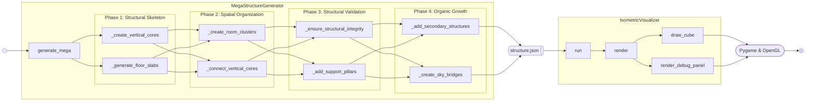

[](https://github.com/gongahkia/gibson/releases/tag/1.0.0) 
[](https://github.com/gongahkia/gibson/releases/tag/2.0.0) 

# `Gibson` 🗼

[Single-file](./src/main.py), [484-line](./src/main.py) megastructure generator and visualiser.

[Megastructure](https://en.wikipedia.org/wiki/Megastructure)s are randomly generated and serialised at `structure.json`.

Structures are visualised from an [isomteric](https://en.wikipedia.org/wiki/Isometric_projection) perspective.

Clicking [`LMB`](https://en.wikipedia.org/wiki/Mouse_button) and [`RMB`](https://en.wikipedia.org/wiki/Mouse_button) rotates the structure 45° left and right respectively.

## Screenshot


## Usage

```console
$ git clone https://github.com/gongahkia/gibson && cd gibson/src
$ python3.12 -m venv gibson_env
$ source gibson_env/bin/activate
$ uv pip install -r requirements.txt
$ python3 main.py
```

## Architecture



## Layout

| Function name | Purpose |
| :--- | :--- |
| `generate_mega()` | orchestrates generation process |
| `_create_vertical_cores()` | generates the main vertical structures |
| `_generate_floor_slabs()` | creates horizontal platforms connecting the vertical cores |
| `_create_room_clusters()` | carves out defined spaces within the structure |
| `_connect_vertical_cores()` | builds bridges and stairs to connect vertical cores |
| `_ensure_structural_integrity()` | checks and removes unsupported elements |
| `_add_support_pillars()` | adds additional vertical supports |
| `_add_secondary_structures()` | generates additional structures |
| `_create_sky_bridges()` | builds elevated connections between distant parts of the structure |
| `save_structure()` and `load_structure()` | handle saving and loading the generated structure to/from a local `.json` file |

## Reference

The name `Gibson` is in reference to American author [William Gibson](https://en.wikipedia.org/wiki/William_Gibson), whose debut novel [*Neuromancer*](https://en.wikipedia.org/wiki/Neuromancer) heavily influenced the [Cyberpunk](https://en.wikipedia.org/wiki/Cyberpunk) aesthetic, going on to inspire works such as [Tsutomu Nihei](https://en.wikipedia.org/wiki/Tsutomu_Nihei)'s (弐瓶 勉) [*Blame!*](https://en.wikipedia.org/wiki/Blame!) and [Masamune Shirow](https://en.wikipedia.org/wiki/Masamune_Shirow)'s (太田正典) [*Ghost in the Shell*](https://en.wikipedia.org/wiki/Ghost_in_the_Shell).


## Research

* [*Simulation of Urban Density Scenario according to the Cadastral Map using K-Means Unsupervised Classification*](https://www.researchgate.net/publication/381057650_Simulation_of_Urban_Density_Scenario_according_to_the_Cadastral_Map_using_K-Means_unsupervised_classification) by M. A. El-Kenawy et al. (2023)
* [*Parametric Modeling for Form-Based Planning in Dense Urban Environments*](https://www.mdpi.com/2071-1050/11/20/5678) by S. A. Abdul-Rahman et al. (2019)
* [*Knowledge-Based Modeling of Buildings in Dense Urban Areas by Fusing LiDAR and Aerial Images*](https://www.mdpi.com/2072-4292/5/11/5944) by J. Jung et al. (2013)
* [*Simulating Urban Growth through Case-Based Reasoning*](https://www.tandfonline.com/doi/full/10.1080/22797254.2022.2056518) by Y. Liu et al. (2022)
* [*Generative Methods for Urban Design and Rapid Solution Space Exploration*](https://arxiv.org/abs/2212.06783) by Y. Sun and T. Dogan (2022)
* [*UrbanSim: Open Source Urban Simulation System*](https://urbansim.com/) by P. Waddell (2002)
* [*A Study of the “Kowloon Walled City”*](https://hub.hku.hk/bitstream/10722/259448/1/Content.pdf) by T. F. Ng (2018)
* [*CAE Simulates Complex Dense Urban Environments with Cesium*](https://cesium.com/blog/2022/02/15/cae-simulates-a-complex-dense-urban-environment/) by CAE (2022)
* [*Simulation of Urban Density Scenario according to the Cadastral Map using K-Means Unsupervised Classification*](https://www.researchgate.net/publication/381057650_Simulation_of_Urban_Density_Scenario_according_to_the_Cadastral_Map_using_K-Means_unsupervised_classification) by M. A. El-Kenawy et al. (2023)
* [*Parametric Modeling for Form-Based Planning in Dense Urban Environments*](https://www.mdpi.com/2071-1050/11/20/5678) by S. A. Abdul-Rahman et al. (2019)
